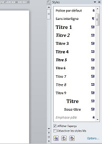
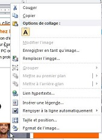
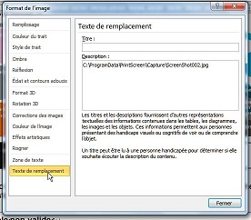

# Recommandations accessibilité pushmail Orange  

## Introduction&nbsp;: l’accessibilité des mails
Les mails au format texte et sans image, comme souvent les mails entre salariés, sont accessibles. Le problème de non accessibilité est plutôt le fait des <i lang="en">push mails</i>. Ces mails, à la mise en forme évoluée (liens, mise en page complexe, illustrations, schémas), permettent la publication de quantité d’informations et sont un outil essentiel de la communication d’entreprise.

### Des solutions alternatives
Et si la mise en page du <i lang="en">push mail</i> est complexe, que l’on n’a pas la possibilité de rendre le <i lang="en">push mail</i> accessible, il existe des solutions alternatives moins élégantes, mais qui fonctionnent toujours&nbsp;:
- Proposer un lien redirigeant vers une page web 
- Mettre en place un lien en début de mail pointant vers un fichier texte ou un fichier Word accessible

### Qui est impacté&nbsp;?
- Les personnes qui ne voient pas 
	- synthèse vocale
	- plage braille
- Les personnes qui voient mal
	- malvoyant, âgé
	- contexte visuel contraint
- Les personnes qui lisent avec difficulté 
	- autre langue maternelle
	- contraintes cognitives et illettrisme
- Les personnes qui ont des difficultés à manipuler
- Les personnes cumulant des difficultés légères (seniors)

## Les critères à respecter

### Considération générale

Ces critères sont génériques et ne présument pas de la manière de fabriquer les mails, mais supposent que le contenu soit du <abbr>HTML</abbr>, seul format permettant une mise en page complexe. Pour les exemples utilisés dans ces recommandations, nous les avons mis en œuvre dans Word qui semble être l’outil privilégié pour fabriquer les <i lang="en">push mail</i> et les gabarits des <i lang="en">newsletters</i>, en interne Orange. Bien sûr, ces recommandations peuvent être appliquées dans n’importe quel outil permettant de fabriquer des mails.

### Simplifier la rédaction du contenu

**Pour qui&nbsp;: ** tout le monde et en particulier, les personnes déficientes visuelles, cognitives, avec des difficultés pour lire ou avec un déficit d’attention.  

**Description&nbsp;: **  
Simplifier le rédactionnel pour tous les utilisateurs.

**À vérifier&nbsp;: **  
S’assurer que le rédacteur utilise&nbsp;:
- Des tournures de phrases limpides
    - des phrases courtes et à la construction simple&nbsp;: sujet, verbe, complément
    - une idée par phrase
    - des mots simples et les mots compliqués doivent être expliqués
    - le présent
    - de préférence, le style direct et la forme active (pas de subjonctif, pas de conjonctions)
- Les caractères typographiques du Français  
    - Tiret - , cadratin —,«&nbsp;guillemets français&nbsp;»
    - Accents même aux majuscules (éèêçàïùÉÈÊÇÀÏÙ)
et n’utilisent pas&nbsp;:
- de mots en anglais, de sigles ou abréviations sauf ceux passés dans le langage courant 

**Objectif&nbsp;: **  
Permettre aux utilisateurs de comprendre facilement le sens du contenu.

### Structurer sémantiquement le contenu

**Pour qui&nbsp;: ** tout le monde, et en particulier les personnes déficientes visuelles, cognitives, avec des difficultés pour lire ou avec un déficit d’attention.  

**Description&nbsp;: **  
Donner une structure cohérente au contenu rédactionnel grâce à la mise en place&nbsp;:
- de titres (balises <abbr>HTML</abbr> `h1` jusqu’à `h6`) 
- de listes (balises <abbr>HTML</abbr> `ol`, `ul` et `li`) 

**À vérifier&nbsp;: **  
- Les titres doivent être pertinents et non vides.
- Il ne doit pas exister de saut dans la hiérarchie des titres (on ne passe pas directement d’un titre `h2` à un titre `h4`).
- On peut mettre plusieurs `h1` par mail (se limiter tout de même à deux dans la majorité des cas).
- les listes doivent être de réelles listes de plusieurs éléments et les listes ordonnées doivent être différenciées de celles qui ne le sont pas.

**Objectif&nbsp;: **  
Permettre aux utilisateurs de facilement comprendre et hiérarchiser le contenu.

**Exemple dans Word&nbsp;: **  
Pour donner une structure sémantique au contenu, il faut utiliser la palette des Styles. En donnant un style (titre, emphase, liste…) à une partie de vote contenu, vous modifiez son apparence mais surtout vous lui donnez de la sémantique.
Cliquer sur le bouton d’ouverture (en bas à droite de l’outil Style dans l’onglet Accueil) ou grâce au raccourci clavier <kbd>Ctrl + Alt + Maj + s</kbd> permet l’ouverture du panneau Style.

  Vous avez accès à des listes (comme avec les boutons dans le bandeau «&nbsp;Accueil&nbsp;» dans le menu «&nbsp;Paragraphe&nbsp;»), aux titres et à toute une série de styles. De préférence utiliser les styles par défaut proposés, il en existe suffisamment. 

### Simplifier la présentation

**Pour qui&nbsp;: ** tout le monde, et en particulier les personnes déficientes visuelles, cognitives, avec des difficultés pour lire ou avec un déficit d’attention.  

**Description&nbsp;: **  
Simplifier la présentation du contenu et respecter les bonnes pratiques pour ce qui est de la présentation. 

**À vérifier&nbsp;: **  
Pour assurer une lecture facile&nbsp;:
- Aligner le texte à gauche, mais ne pas le justifier
- Utiliser une police de caractères facilement lisible en corps 12 pixels minimum
- Mettre  en place une ponctuation simple
- Ne pas mettre d’italiques, ni de phrases en majuscules, mais une majuscule en début de phrase
- Éviter les fonds texturés (images)
- Ne pas faire de retours chariots répétés ou de tabulation pour espacer (mais la fonction «&nbsp;Paragraphe &gt; Espacement&nbsp;» ou «&nbsp;Retrait&nbsp;» dans Word)
- Éviter les tableaux de mise en page ou de données
- Mettre en place un indicateur de fin de mail (par exemple, une image indiquant«&nbsp;fin de mail&nbsp;», un texte blanc sur fond blanc «&nbsp;fin de mail&nbsp;»)

**Objectif&nbsp;: **
S’assurer que la présentation n’empêche pas l’accès au contenu et à sa compréhension.

### Donner une alternative aux images

**Pour qui&nbsp;: ** tout le monde, et en particulier les personnes déficientes visuelles ou cognitives.  

**Description&nbsp;: **  
Mettre en place des alternatives textuelles à tous les éléments informatifs non-textuels (images, icônes…). 
Mettre pour toute image (balise `img` en <abbr>HTML</abbr>) une alternative pertinente (un attribut `alt` en <abbr>HTML</abbr>)&nbsp;: 
- Pour les images cliquables&nbsp;: préciser la fonction / la cible du lien dans l’alternative,
- Pour les images porteuses d’information&nbsp;: mettre une alternative décrivant l’information contenue dans l’image,
- Pour les images contenant du texte&nbsp;: mettre une alternative reprenant au moins le texte de l’image,
- Pour les images décoratives&nbsp;: mettre une alternative vide,
- Pour les images dont le contenu de l’alternative serait trop long (schémas, graphes…), mettre à proximité de l’image décrite soit sa description sous forme d’une texte dans le mail, soit un lien pointant vers une page <abbr>HTML</abbr> contenant cette description.

**À vérifier&nbsp;: **  
Toute image doit posséder une alternative qui ne reflète que le contenu informatif qu’elle porte.
Pour les graphes, la solution peut être de mettre un lien sous l’image permettant d’accéder à un tableau de chiffre en bas du mail, par exemple.
Une alternative doit être&nbsp;:
- Précise et équivalente au contenu de l’image ou sa fonction
- Succincte : quelques mots à deux phrases courtes
- Non redondante&nbsp;: ne pas fournir la même information que dans le texte environnant
- Sans texte générique, pas besoin d’alternative du type «&nbsp;image de…&nbsp;», «&nbsp;graphique sur…&nbsp;», «&nbsp;lien vers…&nbsp;», etc.

**Objectif&nbsp;: **  
Permettre l’accès à l’information véhiculée dans une image pour des utilisateurs qui n’y ont pas accès.
Point bloquant&nbsp;: une image sans description textuelle est inexploitable par des personnes ayant des déficiences visuelles ou celles n’affichant pas les images (mobile, faible bande passante…).

**Exemple dans Word&nbsp;: **  

Il faut donner une alternative textuelle (texte de replacement) à toute image dans Word. Pour cela, il faut accéder aux propriétés de cette image. Sélectionner l’image, faire un clic droit, puis «&nbsp;Format de l’image&nbsp;» et «&nbsp;Texte de remplacement&nbsp;».

 

Ne pas remplir le champ «&nbsp;Titre&nbsp;», le laisser vide. En revanche, saisir dans le champ «&nbsp;Description&nbsp;» (seul champ lu par une synthèse vocale) le texte alternatif donnant l’information équivalente à celle contenue dans l’image. Si l’image ne porte pas d’information, laisser les deux champs «&nbsp;Titre&nbsp;» et «&nbsp;Description&nbsp;» vides.

### Spécifier la langue du mail et les changements éventuels

**Pour qui&nbsp;: ** les personnes déficientes visuelles.  

**Description&nbsp;: **  
Spécifier la langue principale du document (l’attribut `lang` et/ou `xml:lang` dans la balise `html`). 
Préciser également la langue d’un contenu exprimé dans une langue autre que la langue principale (l’attribut `lang` et/ou `xml:lang` dans l’élément <abbr>HTML</abbr> contenant l’expression en langue étrangère).  

**À vérifier&nbsp;: **  
Pour les mots ou les expressions en langue étrangère passés dans l’usage courant (Google, newsletter…) ou les noms propres, ne pas indiquer de changement de langue.

**Objectif&nbsp;: **  
Cette indication permet à la synthèse vocale d’adapter la prononciation en fonction de la langue utilisée.

**Exemple pour une page en français&nbsp;: **  
- pour du <abbr>HTML</abbr>&nbsp;: `<html lang="fr">`
- pour du XHTML&nbsp;: `<html xmlns="http://www.w3.org/1999/xhtml" xml:lang="fr" lang="fr">`

**Exemple de changement de langue&nbsp;: **  
`découvrir Orange live TV`

**Exemple pour Word&nbsp;:**
Pour modifier la langue du document ou d’une partie du contenu (après sélection de ce contenu), on utilise dans l’onglet «&nbsp;Révision&nbsp;», l’élément «&nbsp;Langue&nbsp;». 

 

Dans le sous-menu de «&nbsp;Langue&nbsp;», on clique sur «&nbsp;Définir la langue de vérification&nbsp;» et dans la fenêtre «&nbsp;Langue&nbsp;», on choisit la langue voulue.

 

### Fournir une mise en page (des tableaux) accessible

**Pour qui&nbsp;: ** les personnes déficientes visuelles.  

**Description&nbsp;: **  
Simplifier la mise en page, bien que les clients de messagerie (Outlook inclus) obligent à utiliser une mise en page en tableau.

**À vérifier&nbsp;: **  
Globalement, ne pas utiliser de mise en page complexe (fusion de cellules d’un tableau, multicolonnage…), 
- Éviter d’imbriquer les tableaux de mise en page (grand maximum, 2 niveaux d’imbrication), mais aussi&nbsp;:
    - Ne pas fusionner les cellules d’un tableau, mais utiliser plusieurs tableaux plus simples
    - Pas de cellules vides
    - Pas d’images de fond 
- Assurer une lecture séquentielle (on doit pouvoir lire de gauche à droite et de haut en bas)
- Éviter les tableaux de données, les graphiques ou les schémas complexes

**Objectif&nbsp;: **  
Permettre, notamment aux utilisateurs de lecteurs d’écran, de comprendre facilement le contenu quelle que soit la mise en page utilisée.

### Rendre accessibles les couleurs et le contraste

**Pour qui&nbsp;: ** tout le monde, en particulier les utilisateurs sur mobile et tablette, les personnes malvoyantes, éprouvant des difficultés de lecture ou avec un déficit d’attention et les seniors.   

**Description&nbsp;: **  
- Le niveau de contraste entre le texte et l’arrière-plan doit être suffisamment élevé.
- La couleur ou une information sensorielle (forme, taille, son, orientation, localisation visuelle…) ne doit pas être la seule façon de véhiculer de l’information, d’indiquer une action, de solliciter une réponse ou de distinguer un élément.

**Objectif&nbsp;: **  
Un niveau de contraste insuffisant est préjudiciable pour les utilisateurs ayant des difficultés visuelles ainsi que pour les utilisateurs de mobiles et tablettes se trouvant dans un environnement très lumineux.
De même, utiliser des informations sensorielles (forme, taille, son, orientation, localisation visuelle…) seules sans alternative empêche ceux qui ne peuvent les interpréter d’agir efficacement voire d’agir tout simplement. 

**Outil&nbsp;: **  
L’application [<i lang="en">Colour Contrast Analyser</i>](http://www.paciellogroup.com/resources/contrastanalyser/) permet de mesurer rapidement des niveaux de contraste de couleurs (gratuit pour Mac et Windows).  

### Identifier les liens et leurs cibles

**Pour qui&nbsp;: ** tout le monde, en particulier les malvoyants, les non-voyants et les personnes ayant des difficultés de lecture.

**Description&nbsp;: **  
Rendre les liens identifiables et compréhensibles hors contexte

**À vérifier&nbsp;: **  
- Souligner les liens pour éviter aux personnes de faire un effort cognitif pour les identifier et ne pas obliger les personnes déficientes motrices (utilisant le clavier) ou malvoyantes à ne les trouver qu’en naviguant dans tout le contenu.
- Ne pas utiliser des intitulés comme «&nbsp;Cliquez ici&nbsp;», «&nbsp;Pour en savoir plus&nbsp;», «&nbsp;Suivez ce lien&nbsp;», «&nbsp;Plus de détails&nbsp;», «&nbsp;Lire la suite&nbsp;», mais des intitulés qui identifient  bien leur cible
- Indiquer l’ouverture de toute nouvelle fenêtre (adresse e-mail, site internet…) en rajoutant à l’intitulé du texte «&nbsp;nouvelle fenêtre&nbsp;» par exemple, car le multifenêtrage qui peut être déjà troublant pour un voyant et tout simplement bloquant pour un non-voyant.

**Objectif&nbsp;: **  
Permettre à un utilisateur n’ayant pas accès au contexte visuel de connaître la destination du lien. Notamment important pour les utilisateurs naviguant grâce à une liste de liens extraite de la page (lecteurs d’écran) ou les utilisateurs de loupe logicielle qui ne voient qu’une fraction de la page. 

### Word et accessibilité, quelques liens

- [<i lang="en">WebAIM: Microsoft Word - Creating Accessible Documents</i>](http://www.webaim.org/techniques/word/) 
- [<i lang="en">Make your Word documents accessible – Microsoft Office Support</i>](https://support.office.com/en-us/article/Creating-accessible-Word-documents-D9BF3683-87AC-47EA-B91A-78DCACB3C66D)
- [Accessibilité des documents Word (en français)](http://www.anysurfer.be/fr/en-pratique/documents/word)

<!--  This file is part of a11y-guidelines | Our vision of mobile & web accessibility guidelines and best practices, with valid/invalid examples.
 Copyright (C) 2016  Orange SA
 See the Creative Commons Legal Code Attribution-ShareAlike 3.0 Unported License for more details (LICENSE file). -->